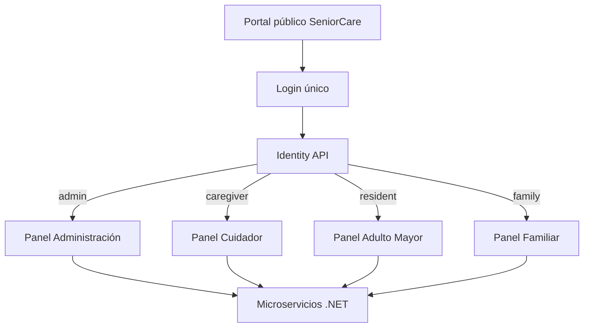

# Arquitectura de SeniorCare OS

## Objetivo

SeniorCare OS está diseñado para reducir la complejidad tecnológica para
personas adultas mayores y, al mismo tiempo, mantener una arquitectura
profesional y escalable para cuidadores, familiares y administradores.

## Patrón general

Se adoptó la disciplina arquitectónica observada en AYUMED, pero conservando el
stack nativo de SeniorCare (.NET, microservicios, PWA, MAUI y Linux):

```text
UI / Controller
      |
      v
Service (reglas de negocio)
      |
      v
Repository (persistencia)
      |
      v
Domain / PostgreSQL
```

Las responsabilidades transversales se concentran en `SeniorCare.Shared`:

- autenticación JWT;
- roles y políticas;
- autorización por residente vinculado;
- manejo global de excepciones;
- correlation ID;
- encabezados de seguridad;
- CORS, observabilidad y health checks.

## Portal público y paneles



La ruta del panel es determinada en backend por `RolePanelService`; el frontend
solo consume el resultado. Esto evita duplicar reglas de redirección.

## Microservicios

- `SeniorCare.Identity.Api`: autenticación, usuarios, roles y tokens.
- `SeniorCare.Care.Api`: residentes y medicamentos.
- `SeniorCare.Emergency.Api`: asistencia y SOS.
- `SeniorCare.Communication.Api`: videollamadas.
- `SeniorCare.Analytics.Api`: métricas.
- `SeniorCare.Etl.Worker`: ETL.

En los servicios que persisten datos se usa la separación:

```text
Controllers/
Services/
Repositories/
Domain/
Program.cs
```

## Seguridad de recursos

El rol por sí solo no es suficiente. Los tokens de las cuentas `resident` y
`family` incluyen `resident_id`. Las APIs comprueban que el recurso solicitado
pertenezca al residente vinculado. Un usuario no obtiene acceso a otra persona
cambiando un GUID en la URL.

El equipo de cuidado (`admin`, `caregiver`) puede operar sobre residentes según
las políticas correspondientes. Administración de usuarios queda limitada a
`admin`.

## SeniorCare como sistema operativo

SeniorCare OS no es únicamente el portal web. La distribución Linux incorpora:

- arranque automático;
- sesión restringida;
- Chromium en modo kiosco;
- servicios `systemd`;
- recuperación automática del kiosco;
- integración prevista con cámara, micrófono, audio y botón SOS USB;
- usuario sin permisos administrativos;
- configuración en `/etc/seniorcare`;
- datos locales en `/var/lib/seniorcare`;
- bitácoras en `/var/log/seniorcare`.

El portal unificado permanece en el puerto `8088`, por lo que el modo kiosco
puede abrir el mismo punto de entrada y el rol determina la experiencia.
