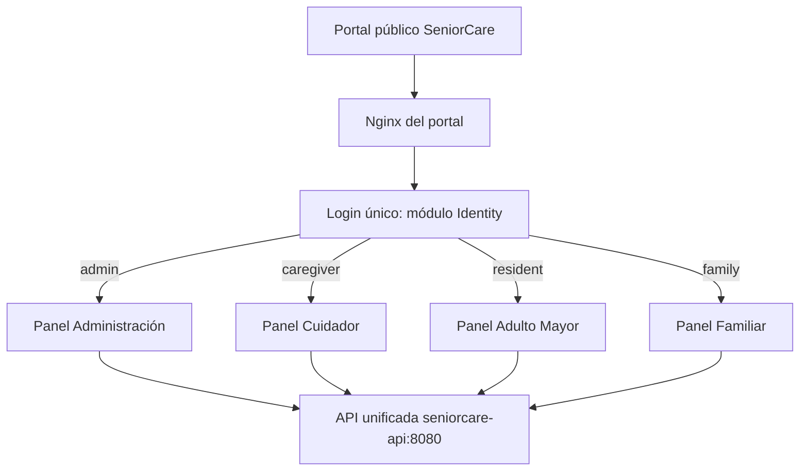

# Arquitectura de SeniorCare OS

## Objetivo

SeniorCare OS está diseñado para reducir la complejidad tecnológica para
personas adultas mayores y, al mismo tiempo, mantener una arquitectura
profesional y escalable para cuidadores, familiares y administradores.

## Patrón general

Se adoptó la disciplina arquitectónica observada en AYUMED, pero conservando el
stack nativo de SeniorCare (.NET 10, PWA, MAUI y Linux). El backend es una sola
API ASP.NET Core (`api/SeniorCare.Api.csproj`, servicio Docker `seniorcare-api`)
compuesta por cinco módulos internos (Identity, Care, Emergency, Communication y
Analytics) que comparten proceso, autenticación y configuración:

```text
UI / Controller
      |
      v
Service (reglas de negocio)
      |
      v
Repository (persistencia)
      |
      v
Modelo / PostgreSQL
```

Las responsabilidades transversales viven en `api/app/Core`, `api/app/Middleware`
y `api/config/ServiceDefaultsExtensions.cs`:

- autenticación JWT;
- roles y políticas;
- autorización por residente vinculado;
- manejo global de excepciones;
- correlation ID;
- encabezados de seguridad;
- CORS, observabilidad y health checks.

## Portal público y paneles



El navegador siempre llega al portal en `http://localhost:8088`; Nginx reenvía
todo `/api/*` a `seniorcare-api:8080`. La ruta del panel la determina en backend
`RolePanelService`; el frontend solo consume el resultado. Esto evita duplicar
reglas de redirección.

## Módulos de la API unificada

`api/Program.cs` registra y expone los cinco módulos mediante los archivos
`api/config/*Module.cs`:

- **Identity** (`/api/identity`): autenticación, usuarios, roles y tokens.
- **Care** (`/api/care`): residentes y medicamentos.
- **Emergency** (`/api/emergencies`): asistencia y SOS.
- **Communication** (`/api/communication`): videollamadas.
- **Analytics** (`/api/analytics`): métricas.

`SeniorCare.Etl.Worker` (`src/Workers/`) es un worker independiente, opcional
mediante el perfil `analytics` de Docker Compose.

Cada módulo mantiene su separación interna dentro de `api/app/`:

```text
api/app/Controllers/<Módulo>/
api/app/Services/<Módulo>/
api/app/Repositories/<Módulo>/
api/app/Models/<Módulo>/
api/config/<Módulo>Module.cs
```

## Seguridad de recursos

El rol por sí solo no es suficiente. Los tokens de las cuentas `resident` y
`family` incluyen `resident_id`. Los módulos comprueban que el recurso
solicitado pertenezca al residente vinculado. Un usuario no obtiene acceso a
otra persona cambiando un GUID en la URL.

El equipo de cuidado (`admin`, `caregiver`) puede operar sobre residentes según
las políticas correspondientes. Administración de usuarios queda limitada a
`admin`.

## SeniorCare como sistema operativo

SeniorCare OS no es únicamente el portal web. La distribución Linux incorpora:

- arranque automático;
- sesión restringida;
- Chromium en modo kiosco;
- servicios `systemd`;
- recuperación automática del kiosco;
- integración prevista con cámara, micrófono, audio y botón SOS USB;
- usuario sin permisos administrativos;
- configuración en `/etc/seniorcare`;
- datos locales en `/var/lib/seniorcare`;
- bitácoras en `/var/log/seniorcare`.

El portal unificado permanece en el puerto `8088`, por lo que el modo kiosco
puede abrir el mismo punto de entrada y el rol determina la experiencia.
